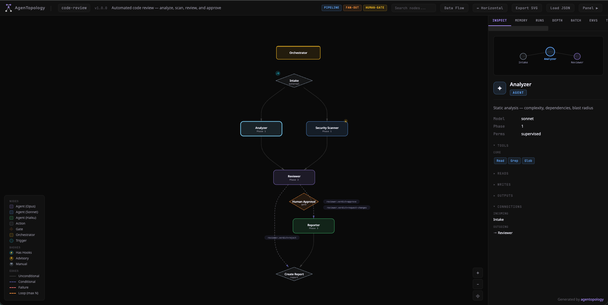

<h1 align="center">AgenTopology</h1>

<p align="center">
  <strong>The Terraform for AI agents.</strong><br/>
  Define your agent team once. Deploy to any platform.
</p>

<p align="center">
  <a href="https://agentopology.com"></a>
  <a href="https://www.npmjs.com/package/agentopology"></a>
  <a href="LICENSE"></a>
</p>

<p align="center">
  <strong>Claude Code</strong> · <strong>OpenClaw</strong> · <strong>Codex</strong> · <strong>Cursor</strong> · <strong>Gemini CLI</strong> · <strong>Copilot</strong> · <strong>Kiro</strong>
</p>

<p align="center">
  <em>Ships with a Claude Code skill — just type <code>/agentopology</code> and describe your team.</em>
</p>

<br/>

## The Problem

Building one AI agent is easy. Building a **team** of agents that actually works together is brutal.

You want a marketing team? A dev pipeline? A support squad? You spend hours wiring up AGENT.md files, soul.md configs, MCP servers, hooks, and scripts. You get it working in Claude Code. Then you need the same team in OpenClaw — and you start from scratch. Different config format. Different directory structure. Different conventions. Same agents, same logic, zero portability.

**OpenClaw alone** needs soul.md, skill files, channel configs, gateway setup, and workspace definitions — for each agent. Multiply that by 5 agents and you're maintaining 20+ files that you can't visualize, validate, or hand off to anyone.

And that's just the platform problem. The architecture problem is worse:

- **How do you see the big picture?** Your topology is scattered across 15 files in nested directories. No diagram. No single source of truth.
- **How do agents talk to each other?** You hack together file-based protocols or copy-paste context between prompts. There's no standard.
- **How do you enforce quality?** You want a gate between stages but there's no standard way to define one.
- **How do you move fast?** Every new agent means touching 5-12 files across multiple tools.

**AgenTopology fixes all of this.**

Write your agent team in one `.at` file. Marketing, development, support, copywriting — any team, any structure. Visualize it. Validate it. Scaffold it to any platform in one command.

```
topology code-review : [pipeline] {
  agent researcher  { model: sonnet  tools: [Read, Grep, WebSearch] }
  agent writer      { model: sonnet  tools: [Read, Write] }
  agent reviewer    { model: opus    tools: [Read, Grep] }

  flow {
    researcher -> writer -> reviewer
    reviewer -> writer  [when reviewer.verdict == revise, max 2]
  }
}
```

```bash
agentopology scaffold my-team.at --target claude-code   # → .claude/agents/
agentopology scaffold my-team.at --target openclaw       # → .openclaw/soul.md
agentopology scaffold my-team.at --target codex          # → .codex/
agentopology scaffold my-team.at --target cursor         # → .cursor/rules/
```

One file. Seven platforms. The topology IS the documentation.

<p align="center">
  
</p>

---

## What It Does

AgenTopology is a **declarative language** (`.at` files) and a **CLI compiler** that transforms agent definitions into platform-native configuration files.

```
┌──────────────┐      ┌────────────┐      ┌─────────────────────┐
│  .at file    │ ───▶ │  Parser &  │ ───▶ │  Platform configs   │
│  (you write) │      │  Validator │      │  (auto-generated)   │
└──────────────┘      └────────────┘      └─────────────────────┘
                                            ├── .claude/agents/
                                            ├── .openclaw/
                                            ├── .codex/
                                            ├── .cursor/rules/
                                            ├── .github/agents/
                                            ├── .kiro/agents/
                                            └── ...
```

You stop hand-maintaining config files. Your topology becomes the single source of truth.

---

## Quick Start

```bash
npm install -g agentopology
```

**Validate** — catch errors before you scaffold:
```bash
agentopology validate my-team.at
```

**Scaffold** — generate platform configs:
```bash
agentopology scaffold my-team.at --target claude-code
```

**Visualize** — see your topology as an interactive graph:
```bash
agentopology visualize my-team.at
```

**List targets** — see all supported platforms:
```bash
agentopology targets
```

---

## Claude Code Skill — The Fastest Way to Start

**You don't need to learn `.at` syntax.** AgenTopology ships with an interactive skill that turns Claude Code into a topology designer. Describe the team you want in plain English — the skill generates everything.

### Setup (one time)

```bash
# Install globally
npm install -g agentopology

# Link the skill into your project
ln -s $(npm root -g)/agentopology/skill .claude/skills/agentopology
```

### Usage

In Claude Code, type `/agentopology` — or just ask naturally:

```
> /agentopology

┌─────────────────────────────────────┐
│  AgenTopology                       │
│  Build agent teams in minutes.      │
├─────────────────────────────────────┤
│                                     │
│  build       Design a new topology  │
│  templates   Pick a proven team     │
│  validate    Check an .at file      │
│  scaffold    Generate platform files│
│  visualize   Open graph viewer      │
│                                     │
└─────────────────────────────────────┘
```

Say **"I want a code review team with an analyzer, security scanner, and reviewer"** — the skill:

1. Generates the `.at` file with the right syntax
2. Validates it against 29 rules
3. Scaffolds it to Claude Code, OpenClaw, Cursor, or any target

**Full agent team in under 2 minutes.** No docs to read. No syntax to memorize. You describe what you want, the skill handles the rest.

---

## Evolving Your Topology

You have a working `.at` file and want to make it better? Just tell the skill what you need:

- **"Add a security scanner agent before the reviewer"** — the skill adds the agent, wires it into the flow, and re-validates
- **"Add a hook that formats code after every write"** — generates the hook block with the right lifecycle event
- **"Add an MCP server for GitHub"** — adds the server config with environment variables
- **"Add a quality gate between the builder and reviewer"** — inserts a gate with halt-on-fail
- **"Switch the target to OpenClaw"** — re-scaffolds the entire topology for a different platform

The workflow is always the same: **describe the change → the skill updates the `.at` file → validates → re-scaffolds.** You never touch config files manually.

After any change, `agentopology visualize` updates the interactive graph so you can see exactly what changed — every agent, connection, tool, hook, and gate in one view.

Full language reference and guides at **[agentopology.com/docs](https://agentopology.com/docs)**.

---

## The Language

`.at` files are human-readable and version-controllable. Here's a real topology:

```
topology content-pipeline : [pipeline, human-gate] {

  meta {
    version: "1.0.0"
    description: "Research, write, review — with quality gate"
  }

  agent researcher {
    model: sonnet
    description: "Gathers information and sources"
    tools: [Read, Grep, WebSearch]
    writes: ["workspace/research.md"]
    prompt {
      Search broadly for relevant sources.
      Compile findings into structured research notes.
      Include citations and source URLs.
    }
  }

  agent writer {
    model: sonnet
    description: "Drafts content from research"
    tools: [Read, Write]
    reads: ["workspace/research.md"]
    writes: ["workspace/draft.md"]
  }

  agent reviewer {
    model: opus
    description: "Reviews drafts for quality"
    tools: [Read, Grep]
    reads: ["workspace/draft.md"]
    outputs: { verdict: approve | revise | reject }
  }

  gates {
    gate quality-check {
      after: reviewer
      run: "scripts/check-quality.sh"
      on-fail: halt
    }
  }

  flow {
    researcher -> writer -> reviewer
    reviewer -> writer  [when reviewer.verdict == revise, max 2]
  }
}
```

This defines three agents, their tools and memory, a quality gate, and a flow with a conditional retry loop — all in 40 lines.

---

## Supported Platforms

| Target | Command | What It Generates |
|--------|---------|-------------------|
| **Claude Code** | `--target claude-code` | `.claude/agents/`, `.claude/skills/`, `.mcp.json`, `.claude/settings.json` |
| **OpenClaw** | `--target openclaw` | `.openclaw/soul.md`, `.openclaw/skills/`, `.openclaw/config.json` |
| **Codex** | `--target codex` | `.codex/config.toml`, `AGENTS.md` |
| **Cursor** | `--target cursor` | `.cursor/rules/*.mdc`, `.cursor/mcp.json`, `.cursor/hooks.json` |
| **Gemini CLI** | `--target gemini-cli` | `.gemini/`, `AGENTS.md` |
| **Copilot** | `--target copilot-cli` | `.github/agents/*.agent.md`, `.github/copilot-instructions.md` |
| **Kiro** | `--target kiro` | `.kiro/agents/*.json`, `.kiro/steering/` |

Every binding is ground-truth validated against real-world configs from production repos.

---

## Language Features

<table>
<tr>
<td width="50%">

**Agents & Models**
```
agent planner {
  model: opus
  tools: [Read, Write, Bash]
  permissions: plan
  thinking: high
  thinking-budget: 4000
  max-turns: 20
}
```

</td>
<td width="50%">

**Flow Graphs**
```
flow {
  intake -> researcher
  researcher -> writer
  writer -> reviewer
  reviewer -> writer  [when verdict == revise, max 3]
  reviewer -> done    [when verdict == approve]
}
```

</td>
</tr>
<tr>
<td>

**Group Chats**
```
group debate-arena {
  members: [pro, con]
  speaker-selection: "round-robin"
  max-rounds: 5
  termination: "judge declares winner"
}
```

</td>
<td>

**Quality Gates**
```
gates {
  gate security-scan {
    after: builder
    run: "scripts/security.sh"
    checks: [vulnerabilities, secrets]
    on-fail: halt
  }
}
```

</td>
</tr>
<tr>
<td>

**Hooks & Events**
```
hooks {
  hook format-on-save {
    on: PostToolUse
    matcher: "Write"
    run: "scripts/format.sh"
  }
}
```

</td>
<td>

**MCP Servers**
```
mcp-servers {
  github {
    command: "npx"
    args: ["-y", "@mcp/server-github"]
    env { TOKEN: "${GITHUB_TOKEN}" }
  }
}
```

</td>
</tr>
</table>

Plus: **memory stores** (semantic, graph, episodic — 11 backends), **retrieval strategies** (scoring weights, cache-hit routing), schemas, artifacts, metering, circuit breakers, scale configs, depth levels, environment overrides, prompt variants, composition via imports, and [more](spec/grammar.md).

---

## Group Chats — Agents That Talk to Each Other

Groups aren't fan-out. They're real conversations. Each agent reads what others wrote and responds:

```
group design-review {
  members: [architect, security-lead, tech-lead]
  speaker-selection: "round-robin"
  max-rounds: 3
  termination: "consensus reached"
}
```

In Claude Code, this compiles to a **file-based protocol** — a shared transcript file that agents read and append to sequentially. No HTTP, no message bus. Just the filesystem as shared state.

---

---

## Programmatic API

```typescript
import { parse, validate, bindings } from "agentopology";

// Parse
const ast = parse(atSource);

// Validate (29 built-in rules)
const issues = validate(ast);

// Scaffold
const files = bindings["claude-code"].scaffold(ast);

// Visualize
import { generateVisualization } from "agentopology";
const html = generateVisualization(ast);
```

---

## Create Your Own Binding

Implement the `BindingTarget` interface to add any platform:

```typescript
import type { BindingTarget } from "agentopology";

export const myBinding: BindingTarget = {
  name: "my-platform",
  description: "My AI Platform",
  scaffold(ast) {
    return [
      { path: "agents.json", content: JSON.stringify(ast.nodes) },
    ];
  },
};
```

---

## Focus on Structure, Not Config Files

The `.at` file IS your architecture diagram. When you open it, you see:
- Who the agents are
- What tools they have
- How work flows between them
- Where the quality gates are
- What happens when things fail

You can `agentopology visualize` it into an interactive graph. You can hand it to a new team member and they understand the system in 30 seconds. Try doing that with 15 scattered AGENT.md files.

| | Config files | AgenTopology |
|---|---|---|
| **Switch platforms** | Rewrite everything | Change `--target` |
| **Add an agent** | Update 5-12 files across 3 tools | Add 4 lines to `.at` file |
| **See the architecture** | Read YAML, JSON, TOML, Markdown across 6 dirs | One `.at` file. Or `visualize` it. |
| **Validate** | Hope for the best | 29 built-in rules catch errors before deploy |
| **Onboard someone** | "Read these 15 files and figure it out" | "Read this `.at` file" |
| **Version control** | Diff 47 generated files | Diff one `.at` file |
| **Move to a new tool** | Start over | `--target new-tool` |

---

## Examples

- [`simple-pipeline.at`](examples/simple-pipeline.at) — Research → write → review with quality gate
- [`code-review.at`](examples/code-review.at) — Multi-agent code review with security scanning
- [`data-processing.at`](examples/data-processing.at) — ETL pipeline with batch processing and metering
- [`scheduled-monitor.at`](examples/scheduled-monitor.at) — Monitoring system with scheduled health checks
- [`openclaw-assistant.at`](examples/openclaw-assistant.at) — Customer support with routing and scheduling

---

## CLI Reference

```
agentopology validate <file>              Validate an .at file
agentopology scaffold <file> --target <t> Generate platform configs
agentopology visualize <file>             Interactive topology graph
agentopology targets                      List supported platforms
agentopology docs [topic]                 Language reference
agentopology info <file>                  Topology summary
agentopology export <file> --format json  Export AST as JSON
```

---

## Contributing

We welcome contributions. The easiest ways to start:

- Add a new [example topology](examples/)
- Improve a [binding](src/bindings/)
- Add [tests](src/bindings/__tests__/)
- Write [documentation](docs/)

Grammar and AST changes require an RFC.

---

## License

Apache 2.0 — see [LICENSE](LICENSE).

---

<p align="center">
  <sub>Created by <a href="https://github.com/nadavnaveh">Nadav Naveh</a></sub>
</p>
